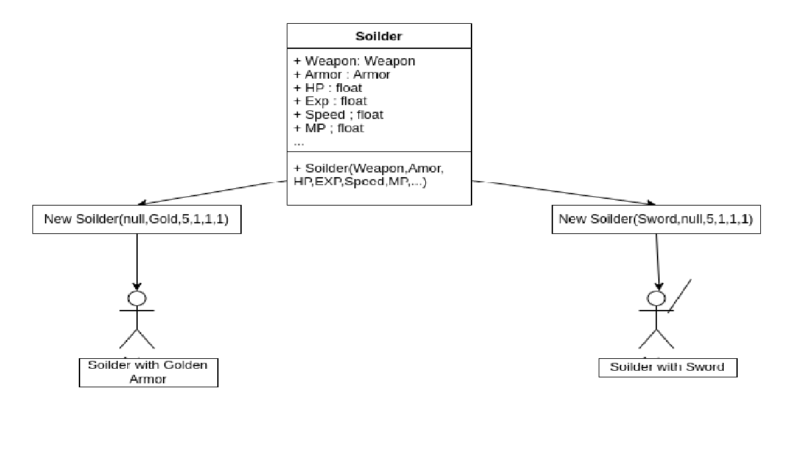
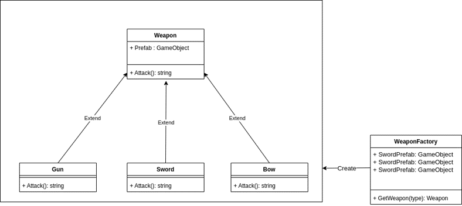
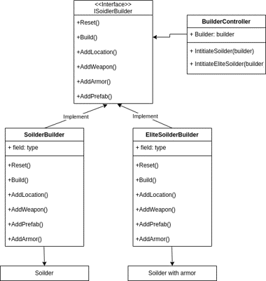

# Demo Factory Pattern combined with Builder Pattern
- Bài toán đặt ra : 
    + Cần tạo ra 1 gameobject - tạm gọi là lính - có rất nhiều bộ phận phức tạp như chân, tay, đầu, vũ khí,...
    + Có nhiều cách khởi tạo khác mhau của 1 lính để tạo ra các loại lính khác nhau. Ví dụ: Khởi tạo lính không có vũ khí, sử dụng tay không và loại có vũ khí có áo giáp,...
    + Đối với vũ khí và áo giáp, có nhiều loại vũ khí và áo giáp khác nhau như cung, kiếm ,súng
    

- Áp dụng Factory Design Pattern vào bài toán :
    +Sử dụng Factory pattern để tạo ra các vũ khí và áo giáp tùy theo input đầu vào của người dùng 
    +Các loại vũ khí đều được extend từ abstract class Weapon, các thao tác của client đều thức hiện vói class cha mà không cần quan tâm đến class con nào đang extend nó.
    + Class Factory sẽ nhận nhiệm vụ đọc input của người dùng để tạo ra loại vũ khí hoặc áo giáp phù hợp
    

- Áp dụng Builder Design Pattern vào bài toán :
    + Tạo ra interface IBuilder để chỉ định các phương thức bắt buộc để tạo ra một lính không bị lỗi
    + Tùy thuộc từng loại lính sẽ có các Builder class implement lại interface trên để tạo ra các lính phù hợp.
    + Các builder sẽ tạo ra từng element của lính một cách lần lượt, sau khi đã đủ để tạo ra 1 lính thì sẽ sử dụng hàm build() để khởi tạo lính đó.
    
